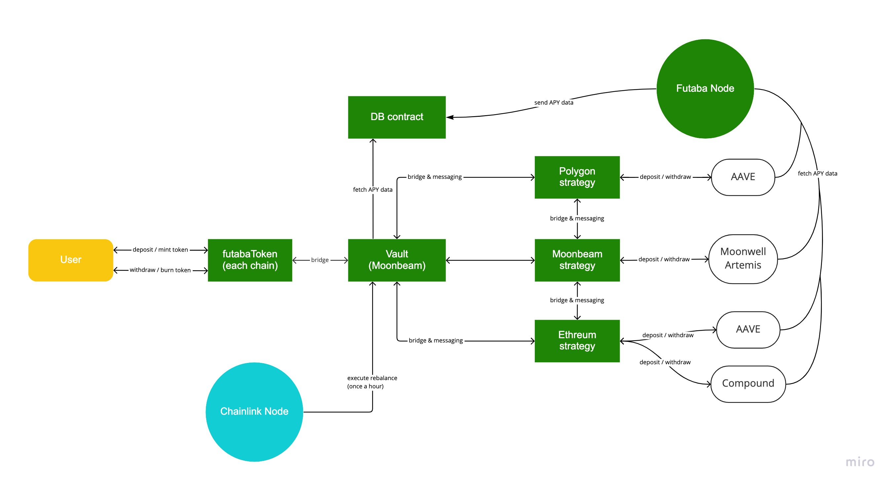

# Konoha - Cross-Chain-Yield-Aggregator

## Summary

Cross chain yield aggregator, which means that not only a single chain, but also the lending protocols of other chains are subject to aggregation, thus ensuring more efficient profits.

### Problems

- Aggregators in a single chain limit the number of protocols that can be utilized, which is not necessarily the optimal yield
- UX is compromised by the need to deposit assets in each of the chains

### Solution

We have developed a cross chain yield aggregator, **Konoha**, where the Vault remains a single chain, but the lending destination is up to multiple chains.

- Aggregation of other chains' lending protocols so that a higher yielding yield aggregator can be achieved
- The UX is high because the user only has to deposit to a specific chain protocol

## Overview

### Architecture

### Overview of each contract

#### Vault contract

- Deposit / redeem of assets
- APY calculations
- Move assets and data
  - Use of Axelar and Sygma
- Only exists in one specific chain

#### Strategy contract

- Deposit / redeem instructions to each lending protocol
- bridge / messaging to strategy contract of other chains

#### Wrapper contract

- Contracts for deposit / redeem in each lending protocol
- Supported protocols
  - AAVE_V3(Polygon)
  - Compound(Ethereum)
  - Moonwell(Moonbeam)

### User Flow

1. User deposits assets(USDC)
2. Minted **kUSDC** in exchange
3. Send deposited USDC to vault(Chains other than Moonbeam will require a bridge)
4. Execute rebalancing via Chainlink node
5. Refer to data in APY for each protocol from DB contract
6. Calculate APY including the cost of the bridge
7. Send assets to the chain of protocols with the highest APY
8. Strategy makes a deposit to the target protocol
9. Repeat steps 4 through 8
10. If assets remain in vault, users can withdraw them
11. Burn **kUSDC** in exchange for withdrawal

## deployed contract
### Moonbase
| contract | contract address | 
|:-----------|------------:|
| Vault       | 0x87989CF71b29C2C51c6feDF267c7Ab224051CE10        | 
| Konoha USDC     | 0x29b0965118CA92fd4Cd00ddfE71632B8DB7dF23f      |
| Chainlink Cron       | 0x2F670bca023e23713cf969F59f1F14efc3394adB        | 
| Strategy         | 0x82EE7812B8ad852D7176c765DC4F736AE0bd1518          | 
### Mumbai
| contract | contract address | 
|:-----------|------------:|
| Strategy         | 0x8C63D54EA63c63E055B19Bba4C1E9C60A56e6eB1          | 
### Goerli
| contract | contract address | 
|:-----------|------------:|
| Strategy         | 0x4005a4060aA40fc9a084EBEEA2d4bD9890A52559          | 

## feature to be implemented

- More chains and protocols supported
- Implementation of more efficient APY calculations
